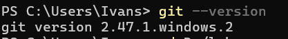

# Git工具安装与使用报告

## 学员GitHub用户名: Ivans-11

## 1. 版本信息截图

## 2. Git命令使用过程总结

### git clone <url>: 克隆远程仓库到本地
`git clone <url> new-folder`：克隆到指定文件夹

`git clone -b branch-name <url>`：指定分支

### git add <file>: 添加文件到暂存区
`git add .`：添加全部修改

`git add -p`：选择修改片段，精细化提交

### git commit -m "message": 提交更改到本地仓库
`git commit`：进入编辑器填写详细描述

`git commit --amend`：修改上一条提交

### git push: 推送更改到远程仓库
`git push origin main`： 提交到指定分支

### git pull: 从远程仓库拉取最新更改

### git branch: 查看本地分支
`git branch <name>`：创建新分支

`git checkout/switch <branch>`：切换分支

`git merge <branch>`：将某分支的更改合并到当前分支。

### `git status`: 查看当前工作区、暂存区状态
用于确认哪些文件被修改、删除、未跟踪