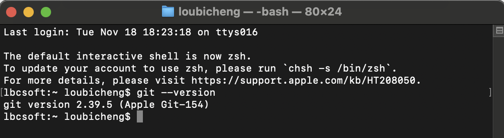

# Git工具安装与使用报告

## 学员GitHub用户名: cnbison

## 1. Git安装过程

mac操作系统，系统自带git

## 2. 遇到的问题及解决方法

无需安装，apple系统自带。

## 3. 版本信息截图


（在此处插入执行`git --version`命令后的截图）

## 4. Git命令使用过程总结

### 核心理念：Git 是什么？

想象 Git 是一个**拥有无限次“存档”功能的游戏系统**，以及一个**可以与朋友共享存档的云端平台**。

*   **你的项目文件夹**：就是**游戏世界**。
*   **`git add`**：是你**决定要把哪些物品放进“存档包”**。
*   **`git commit`**：是你**创建一个“存档点”**，并附上一句描述（例如：“打败了恶龙”）。
*   **`git push`**：是你**把本地存档上传到云端**，让朋友们也能下载。
*   **`git pull`**：是你**下载朋友们最新的云端存档**，与你的游戏世界合并。

Git 的核心工作流程围绕着三个区域：
1.  **工作目录**：你实际编辑文件的地方。
2.  **暂存区**：一个准备区，你在这里决定下次提交要包含哪些更改。
3.  **本地仓库**：你的本地数据库，存储着所有的提交历史。


### Git 命令详解与使用体验

#### 1. `git clone`：获取项目蓝图

*   **作用**：将一个远程仓库（如 GitHub、Gitee 上的项目）完整地复制到你的本地计算机。
*   **何时使用**：当你第一次参与一个项目，或者想下载一个开源项目到本地学习或使用时。
*   **使用体验和理解**：
    `git clone <仓库URL>` 这个命令就像是**从图书馆借了一本完整的、带有所有历史记录的书**。你不仅得到了最新的内容，还得到了这本书从第一页开始的所有修改记录。执行后，你会得到一个与远程仓库同名的文件夹，里面包含了所有的项目文件和一个隐藏的 `.git` 文件夹（这是 Git 的核心，记录着一切历史）。

    ```bash
    # 克隆一个项目
    git clone https://github.com/user/project.git
    ```

#### 2. `git status`：检查当前状态（最重要的命令）

*   **作用**：显示工作目录和暂存区的状态。它会告诉你哪些文件被修改了、哪些是新文件、哪些文件已经添加到了暂存区。
*   **何时使用**：在任何 Git 操作之前，都应该先运行 `git status` 来了解当前的状态。**这是最常用的命令，是你的“仪表盘”**。
*   **使用体验和理解**：
    `git status` 就像**你的 GPS 导航**，它清晰地告诉你：“你现在在这里”，“你已经规划好了去 A 点的路线（已暂存）”，“但你还有一条去 B 点的路没规划（未暂存）”。它会用不同颜色（红色代表未暂存，绿色代表已暂存）提示你，让你在提交前对一切了如指掌，避免误操作。

#### 3. `git add`：精心挑选要提交的更改

*   **作用**：将工作目录中的文件更改添加到暂存区，为下一次提交做准备。
*   **何时使用**：当你修改了一个或多个文件，并希望将这些修改包含在下一次提交中时。
*   **使用体验和理解**：
    这个命令给了你**极大的控制权**。你不是一次性提交所有更改，而是可以像**挑选商品一样**，精确地选择要“打包”的文件。
    *   `git add <file_name>`：只添加指定的文件。
    *   `git add .` 或 `git add -A`：添加当前目录下所有已修改和新增的文件。
    这个过程强迫你思考：“这次提交的目的是什么？哪些文件是与这个目的相关的？” 这有助于形成**原子化提交**，即每次提交只做一件事，便于历史追溯和代码审查。

#### 4. `git commit`：创建一个有意义的“存档点”

*   **作用**：将暂存区中的所有更改作为一个快照，永久保存到本地仓库。每次提交都会生成一个唯一的 ID。
*   **何时使用**：当你通过 `git add` 将所有相关文件添加到暂存区，并准备好为这些更改创建一个历史记录时。
*   **使用体验和理解**：
    `git commit -m "你的提交信息"` 是你作为开发者的**“签名”**。提交信息至关重要，它必须清晰、准确地描述你**“为什么”**做这些更改，而不仅仅是**“做了什么”**。
    *   好的信息：`feat: add user login page` 或 `fix: resolve memory leak in data parser`
    *   坏的信息：`update files` 或 `bug fix`
    每次 `commit` 都像是在项目的历史长河中立下一个里程碑。一个好的提交历史本身就是一份优秀的项目文档。**这是你对项目未来负责的体现**。

#### 5. `git push`：分享你的工作成果

*   **作用**：将本地仓库的提交推送到远程仓库，与团队成员共享你的更改。
*   **何时使用**：当你完成了一部分功能开发或 Bug 修复，并希望将这些更改同步到远程仓库（如 GitHub）时。
*   **使用体验和理解**：
    `git push origin main` 这个命令就像是**把你的本地存档上传到云端**。
    *   `origin`：是远程仓库的默认别名。
    *   `main`：是你想要推送的分支名。
    在执行 `push` 之前，最好先 `git pull` 一下，以避免代码冲突。`push` 是一个**协作的起点**，它将你的个人工作成果变成了团队共享资产。

#### 6. `git pull`：同步团队的最新进展

*   **作用**：从远程仓库获取最新的更改，并与你本地的代码进行合并。它实际上是 `git fetch`（获取）和 `git merge`（合并）两个命令的组合。
*   **何时使用**：在开始工作之前，以确保你的本地代码是最新的；或者在 `push` 之前，以避免推送时被拒绝。
*   **使用体验和理解**：
    `git pull` 就像**更新你的游戏到最新版本**。它会告诉你云端有哪些新内容，并尝试将这些新内容与你的本地版本合并。
    *   **理想情况**：自动合并成功。
    *   **冲突情况**：如果你和队友修改了同一个文件的同一行，Git 会不知道该听谁的，从而产生**合并冲突**。这时，Git 会在文件中标记出冲突部分，需要你手动编辑，决定保留哪份代码或如何融合，然后再次 `add` 和 `commit`。**解决冲突是 Git 协作中的核心技能之一**。

---

### 其他关键命令的体验

*   **`git branch`**：**创建一个新的“平行宇宙”**。当你想开发一个新功能或尝试一个大胆的想法时，可以创建一个新分支，这样就不会影响主线（`main` 分支）的稳定。
*   **`git checkout <branch_name>`**：**穿梭到不同的平行宇宙**。切换到你想要的分支上继续工作。
*   **`git merge <branch_name>`**：**将一个平行宇宙的成果合并到当前宇宙**。当你在一个分支上完成了工作，可以将其合并回主线。
*   **`git log`**：**查看完整的历史时间线**。你可以看到所有的提交记录、作者、时间和提交信息，是项目的“编年史”。
*   **`git stash`**：**“乾坤大挪移”**。当你正在一个分支上工作，但需要紧急切换到另一个分支去修复 Bug，而当前的工作又不想提交时，`git stash` 可以帮你把当前的修改（包括暂存和未暂存的）暂时“藏”起来，让你可以在一个干净的工作区上切换分支。

### 总结：我的理解

使用 Git 的过程，是一个**从混乱到有序，从个人到团队**的转变。

1.  **个人工作**：`add` -> `commit` -> `add` -> `commit`... 这是一个在本地创建清晰、有意义的历史记录的过程。
2.  **团队协作**：`pull` -> (工作) -> `add` -> `commit` -> `push`。这是一个与团队保持同步、贡献自己工作成果的循环。

最终，你会发现，你不再害怕修改代码，因为你知道每一步都有“存档”；你不再害怕与他人协作，因为 Git 提供了清晰的机制来合并和管理各自的工作。**掌握 Git，就是掌握了一种高效、安全、可追溯的现代化软件开发协作方式。**

---

## CI 自动评分与运行指引
- 课程作业检测仅在 PR 到 main 时执行，请通过 Pull Request 提交本文件。
- 文件命名：assignments/lesson2/{你的GitHub用户名}.md。
- 自动评分工作流： [.github/workflows/calculate-score.yml](../../.github/workflows/calculate-score.yml)。
- 首次 Fork 后：进入 Actions → 选择 “Calculate Student Score” → 点击 “Run workflow” 并选择 main → 在日志中查看成绩。