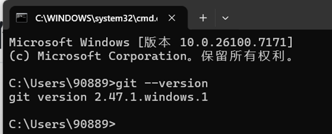
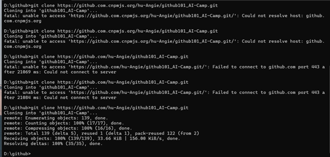
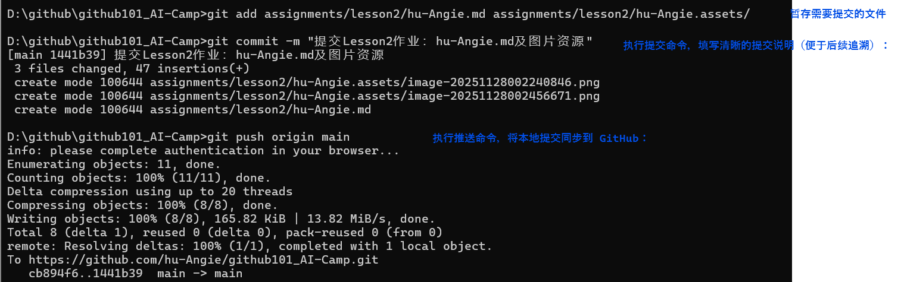

# Git工具安装与使用报告

## 学员GitHub用户名: hu-Angie

## 1. Git安装过程

windows操作系统安装，之前已安装过

## 2. 遇到的问题及解决方法
无

## 3. 版本信息截图

（在此处插入执行`git --version`命令后的截图）

## 4. Git命令使用过程总结

（在此处总结使用Git命令的过程，包括但不限于以下操作：
- git clone: 克隆远程仓库到本地

- 

  

  克隆的结果显示如下

  

  遇到的主要问题是，由于网络波动，始终克隆不下来，也进行网页搜索，AI辅助解决问题使用了镜像源，最后以第二天无网络波动问题，再次克隆成功为结果。

  

- git add: 添加文件到暂存区

  Ps:Git 命令必须在**克隆后的仓库文件夹内**（项目文件夹）执行，因为只有仓库根目录下才有`.git`文件夹（Git 的核心配置目录）。之前停留在`D:\github`（总目录）， “不是 Git 仓库，命令运行失败

从git status输出可以看到，本地仓库有以下状态的文件：

--已删除文件：assignments/lesson2/example-report.md（可能是你误删或故意删除的示例文件）

--未跟踪文件：hu-Angie.md（你的作业文件）和hu-Angie.assets/（图片资源文件夹）

- git commit: 提交更改到本地仓库

- git push: 推送更改到远程仓库

  

- git pull: 从远程仓库拉取最新更改
  

---

## CI 自动评分与运行指引
- 课程作业检测仅在 PR 到 main 时执行，请通过 Pull Request 提交本文件。
- 文件命名：assignments/lesson2/{你的GitHub用户名}.md。
- 自动评分工作流： [.github/workflows/calculate-score.yml](../../.github/workflows/calculate-score.yml)。
- 首次 Fork 后：进入 Actions → 选择 “Calculate Student Score” → 点击 “Run workflow” 并选择 main → 在日志中查看成绩。
