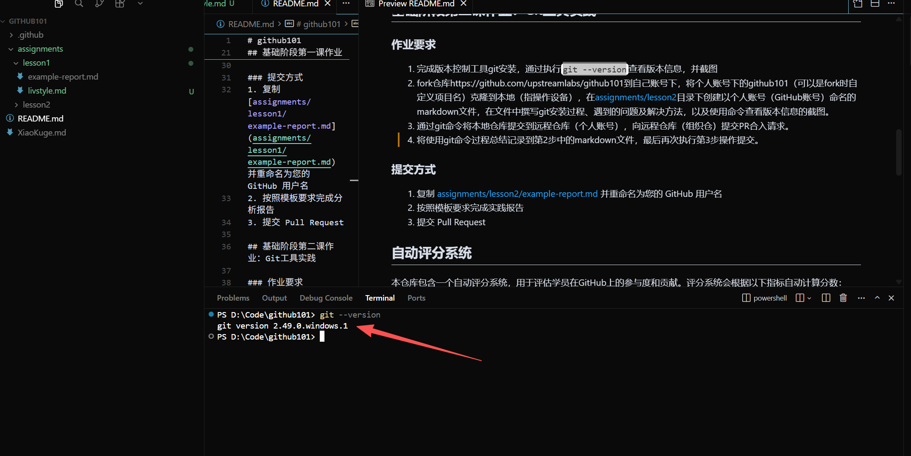

# Git工具安装与使用报告

## 学员GitHub用户名: livstyle

## 1. Git安装过程

### 操作系统环境
- **操作系统**: Windows 10 (版本 10.0.26100)
- **安装方式**: 从Git官方网站下载Windows安装程序

### 安装步骤
1. 访问Git官方网站 https://git-scm.com/downloads
2. 下载适用于Windows的最新版本Git安装程序
3. 运行安装程序，按照以下配置进行安装：
   - 选择默认编辑器（推荐使用VS Code或其他常用编辑器）
   - 选择"Git from the command line and also from 3rd-party software"以便在命令行和其他工具中使用Git
   - 选择"Use the OpenSSL library"作为HTTPS传输后端
   - 配置行尾转换：选择"Checkout Windows-style, commit Unix-style line endings"
   - 选择终端模拟器：使用MinTTY（默认终端）
   - 配置额外选项：启用文件系统缓存和Git Credential Manager
4. 完成安装，点击Finish

### 验证安装
安装完成后，打开PowerShell或命令提示符，执行以下命令验证安装：
```bash
git --version
```

## 2. 遇到的问题及解决方法

### 问题1：中文乱码问题
**问题描述**: 在Windows系统的命令行中，Git命令输出中文时出现乱码。

**解决方法**:
```bash
# 设置Git使用UTF-8编码
git config --global core.quotepath false
git config --global gui.encoding utf-8
git config --global i18n.commit.encoding utf-8
git config --global i18n.logoutputencoding utf-8
```

### 问题2：首次配置用户信息
**问题描述**: 首次使用Git需要配置用户名和邮箱。

**解决方法**:
```bash
# 配置全局用户名
git config --global user.name "livstyle"

# 配置全局邮箱
git config --global user.email "your-email@example.com"

# 查看配置
git config --global --list
```

### 问题3：SSH密钥配置
**问题描述**: 为了安全便捷地与GitHub交互，需要配置SSH密钥。

**解决方法**:
```bash
# 生成SSH密钥
ssh-keygen -t ed25519 -C "your-email@example.com"

# 启动ssh-agent
eval "$(ssh-agent -s)"

# 添加SSH私钥
ssh-add ~/.ssh/id_ed25519

# 复制公钥内容并添加到GitHub账户
cat ~/.ssh/id_ed25519.pub
```
然后在GitHub网站上：Settings → SSH and GPG keys → New SSH key，粘贴公钥内容。

## 3. 版本信息截图

通过执行 `git --version` 命令查看Git版本信息：



从截图可以看到，当前安装的Git版本信息已成功显示。

## 4. Git命令使用过程总结

### 4.1 克隆远程仓库
首先，我从GitHub上fork了 `upstreamlabs/github101` 仓库到我的个人账号下，然后使用以下命令克隆到本地：

```bash
# 克隆远程仓库到本地
git clone https://github.com/livstyle/github101.git

# 或者使用SSH方式（推荐）
git clone git@github.com:livstyle/github101.git

# 进入项目目录
cd github101
```

**命令说明**: `git clone` 命令用于将远程仓库完整地下载到本地，包括所有历史提交记录。

### 4.2 查看仓库状态
```bash
# 查看当前工作区状态
git status

# 查看简洁状态
git status -s
```

**命令说明**: `git status` 显示工作区和暂存区的状态，可以看到哪些文件被修改、哪些文件待提交。

### 4.3 添加文件到暂存区
```bash
# 添加指定文件到暂存区
git add assignments/lesson2/livstyle.md

# 添加所有修改的文件
git add .

# 添加所有指定类型的文件
git add *.md
```

**命令说明**: `git add` 将工作区的修改添加到暂存区，为下一次提交做准备。

### 4.4 提交更改到本地仓库
```bash
# 提交暂存区的内容到本地仓库
git commit -m "完成第二课作业：Git工具安装与实践报告"

# 修改上一次提交（未push的情况下）
git commit --amend -m "更新提交信息"

# 查看提交历史
git log
git log --oneline --graph --all
```

**命令说明**: `git commit` 将暂存区的内容正式提交到本地仓库，`-m` 参数后跟提交信息，描述本次修改的内容。

### 4.5 推送到远程仓库
```bash
# 推送到远程仓库的main分支
git push origin main

# 首次推送并设置上游分支
git push -u origin main

# 强制推送（谨慎使用）
git push -f origin main
```

**命令说明**: `git push` 将本地仓库的提交推送到远程仓库，使远程仓库与本地保持同步。

### 4.6 拉取远程更新
```bash
# 拉取远程仓库的最新更改并合并
git pull origin main

# 获取远程更新但不合并
git fetch origin
```

**命令说明**: `git pull` 相当于 `git fetch` + `git merge`，用于获取远程仓库的最新内容并合并到当前分支。

### 4.7 分支管理
```bash
# 查看所有分支
git branch -a

# 创建新分支
git branch feature-branch

# 切换分支
git checkout feature-branch

# 创建并切换到新分支
git checkout -b feature-branch

# 合并分支
git merge feature-branch

# 删除分支
git branch -d feature-branch
```

**命令说明**: Git的分支功能非常强大，可以在不影响主分支的情况下进行功能开发和测试。

### 4.8 查看差异
```bash
# 查看工作区与暂存区的差异
git diff

# 查看暂存区与最后一次提交的差异
git diff --cached

# 查看两个提交之间的差异
git diff commit1 commit2
```

### 4.9 远程仓库管理
```bash
# 查看远程仓库信息
git remote -v

# 添加远程仓库（添加上游仓库）
git remote add upstream https://github.com/upstreamlabs/github101.git

# 从上游仓库拉取更新
git fetch upstream
git merge upstream/main
```

**命令说明**: 当fork仓库后，可以添加原始仓库作为上游remote，方便同步最新的更改。

### 4.10 撤销操作
```bash
# 撤销工作区的修改
git checkout -- filename

# 取消暂存
git reset HEAD filename

# 回退到指定提交
git reset --soft HEAD^  # 保留更改
git reset --hard HEAD^  # 丢弃更改
```

## 5. 学习心得与体会

通过本次Git工具的安装和实践，我对版本控制系统有了更深入的理解：

1. **版本控制的重要性**: Git可以记录项目的每一次修改，方便回溯历史和协作开发。

2. **分布式特性**: Git是分布式版本控制系统，每个开发者都有完整的代码库，即使离线也能继续工作。

3. **工作流程清晰**: 工作区 → 暂存区 → 本地仓库 → 远程仓库的流程设计合理，既保证了灵活性，又提供了安全性。

4. **分支管理强大**: 分支功能让并行开发变得简单，可以在不同分支上进行不同的功能开发，互不影响。

5. **协作开发便利**: 通过fork、clone、pull request等机制，可以方便地参与开源项目和团队协作。

6. **需要持续学习**: Git命令众多，功能强大，需要在实践中不断学习和掌握更多高级用法。

## 6. 提交PR的完整流程

### 第一次提交
1. Fork远程仓库到个人账号
2. Clone个人仓库到本地
3. 创建并编辑 `assignments/lesson2/livstyle.md` 文件
4. 执行以下Git命令：
```bash
git add assignments/lesson2/livstyle.md
git commit -m "添加lesson2作业：Git工具安装与实践"
git push origin main
```
5. 在GitHub上向上游仓库提交Pull Request

### 第二次提交（补充命令总结）
1. 完善第4部分"Git命令使用过程总结"
2. 执行以下Git命令：
```bash
git add assignments/lesson2/livstyle.md
git commit -m "完善lesson2作业：补充Git命令使用总结"
git push origin main
```
3. 再次向上游仓库提交Pull Request或更新现有PR

通过这个完整的流程，我深刻体会到了Git在实际项目中的应用价值，为后续的开源协作打下了坚实的基础。

