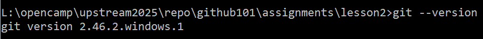

# Git工具安装与使用报告

## 学员GitHub用户名: example-user

## 1. Git安装过程

- os: win7
- 安装过程：到git官网下载setup程序，一直下一步
- git基本配置：
    ```bash
    $ git config --global user.name “用户名”
    $ git config --global user.email “你的个人邮箱”
    ```

## 2. 遇到的问题及解决方法

没有遇到安装问题


## 3. 版本信息截图



## 4. Git命令使用过程总结

**一般开发协作流程**

### 1. 创建仓库，保持同步

根据仓库的来源，分两种情况：

- 如果是克隆仓库，直接用 `git clone`，不要手动初始化。
    - fork the repo
    - git clone remote-repo-url

- 如果是本地仓库关联远程，确保远程仓库是同一个项目的延续（而非全新的仓库）。
    先在本地git init，然后在远程创建好仓库，然后设置好关联，之后及时保持同步
    - git remote add origin remote-repo-url
    - 将本地仓库与远程仓库地址关联
    - git remote -v
    - 查看远程仓库在本地的name & url


### 2. 在本地仓库，创建功能分支

`git checkout -b feature/your-feature-name`
先切换到的项目目录，使用以下命令创建并切换到新分支：git checkout -b feature/your-feature-name
创建新分支，才能提交代码更改，不能在原有分支上更改代码！


### 3. 在本地仓库的功能分支，修改代码、提交
在功能分支上进行开发后，您可以提交更改(将更改提交到本地)：
- `git add .`
- `git commit -m "描述您的更改"`

### 4. 把本地分支的提交，推送到远程仓库，并创建pr
- 将更改推送到您的Fork中：
`git push origin feature/your-feature-name`
- 会在fork中自动创建新的分支feature/your-feature-name
`创建 Pull Request（PR）`


### 5.  参与代码审查，合入PR

设为草稿：PR暂不会被合并，标题前会出现【WIP】，点击「准备就绪」可以取消草稿状态，点击「关闭」则可以关闭该PR。
关闭PR：该PR不再需要被处理，同时也不会合并到主分支
合入：提交的修改将会被合并入主分支

`fork --> clone --> checkout -b newbranch --> make change --> git add --> git commit --> git push --> pr`

### 6.为远程仓库配置个人访问token

A fork is a copy of a repository. Forking a repository allows you to freely experiment with changes without affecting the original project. View existing forks.

（在此处总结使用Git命令的过程，包括但不限于以下操作：
- git clone: 克隆远程仓库到本地
- git add: 添加文件到暂存区
- git commit: 提交更改到本地仓库
- git push: 推送更改到远程仓库
- git pull: 从远程仓库拉取最新更改
等其他相关命令的使用体验和理解）

---

## CI 自动评分与运行指引
- 课程作业检测仅在 PR 到 main 时执行，请通过 Pull Request 提交本文件。
- 文件命名：assignments/lesson2/{你的GitHub用户名}.md。
- 自动评分工作流： [.github/workflows/calculate-score.yml](../../.github/workflows/calculate-score.yml)。
- 首次 Fork 后：进入 Actions → 选择 “Calculate Student Score” → 点击 “Run workflow” 并选择 main → 在日志中查看成绩。
