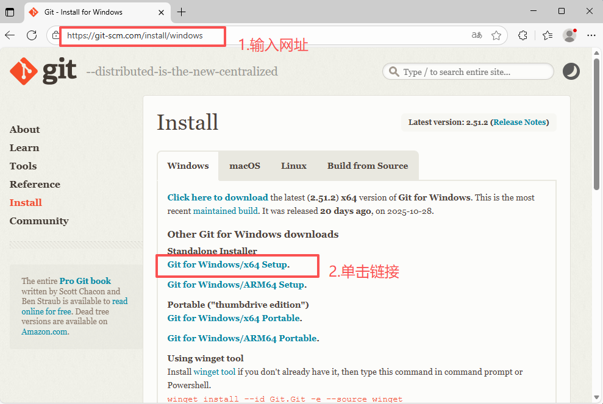
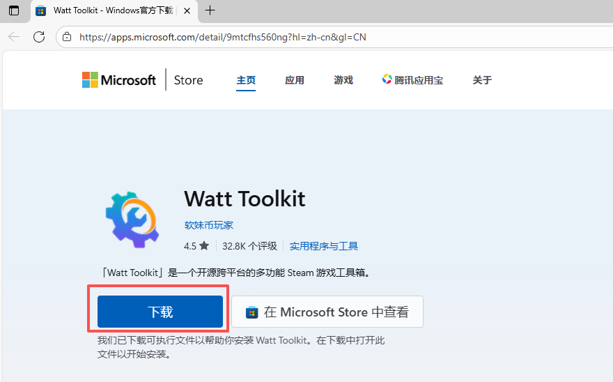
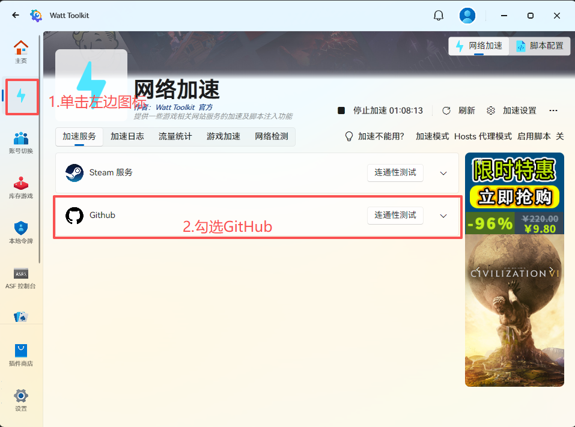
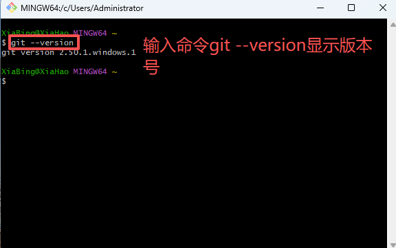

# Git工具安装与使用报告

## 学员GitHub用户名: saymain

## 1. Git安装过程

以Windows系统为例，下载Git安装包，并安装到本地。

下载网址:[https://git-scm.com/install/windows]

选择 "Git for Windows/x64 Setup"，下载到本地后，单击安装文件完成Git安装。

## 2. 遇到的问题及解决方法

国内访问Github有时较慢甚至不能访问，可从微软应用商店下载Watt Toolkit加速器。下载到本地后，单击安装文件完成Watt Toolkit安装。

设置Watt Toolkit，加速访问GitHub：

## 3. 版本信息截图

在Windows开始菜单中打开Git Bash，输入命令 git --version，会显示当前安装的Git版本：

## 4. Git命令使用过程总结

| 命令 | 用途 |
|------|------|
| git config --global user.name "您的GigHub用户名" | 首次使用Git要配置GitHub账号 |
| git config --global user.email "注册GigHub账号的邮箱地址" | 首次使用Git要配置GitHub账号注册使用的邮箱 |
| cd < folder > | 进入某个目录 |
| git clone < url >| 克隆远程仓库到本地 |
| git status | 查看当前文件更改状态 |
| git add < filename > 或 git add . | 添加文件到暂存区 |
| git commit -m "本次修改内容的摘要" | 提交更改到本地仓库 |
| git push origin main | 推送本地提交到远程仓库 |
| git pull origin main | 从远程拉取最新代码 |
| git branch | 查看当前分支 |
| git checkout -b 新分支名 | 创建并切换到新分支 |
